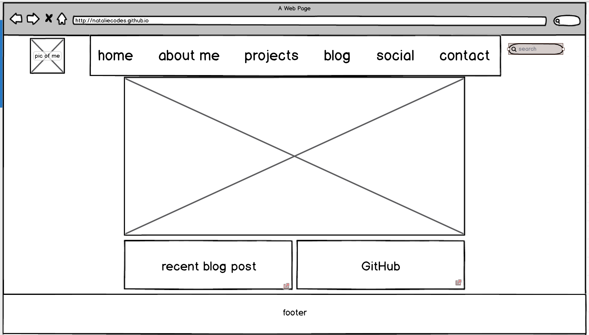
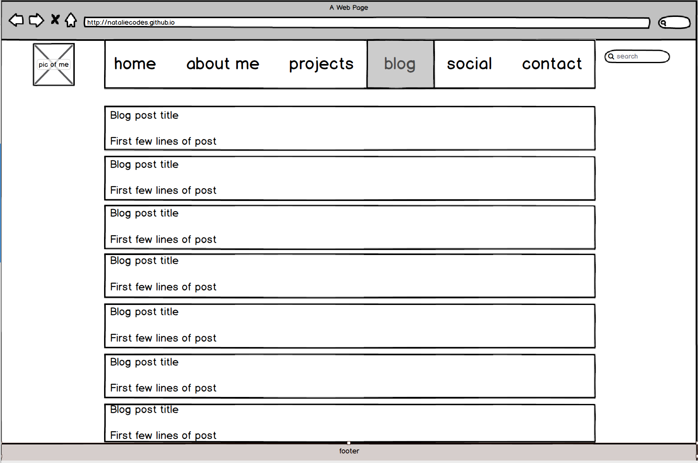

What is a wireframe?

  A wireframe is often the first step to creating a website, whose purpose is to show the site's design hierarchy without the distraction of fonts, colors, etc. It’s the skeleton of a website, where styling doesn't matter.

What are the benefits of wireframing?

  Wireframing allows the designer/developer to start with the basic functionality of the site, be sure it’s solid, and then add to the design. It secures functionality before adding in aesthetics.

Did you enjoy wireframing your site?

  It was OK. I understand that planning is vital to the beginning of a project, but since I do not definitively know the content that will be included in the site, it's not as easy to do. I basically just included what was given on the assignment and tweaked it slightly.

Did you revise your wireframe or stick with your first idea?

  I made a few changes as I went. For example, I was going to make a sidebar search on my blog, but realized it was superfluous. I only thought about including it because I've seen it on other blogs. I also played around with the shapes of everything - i.e. button vs. rectangle with text - and opted to use rectangles and free floating text because it was simpler.

What questions did you ask during this challenge? What resources did you find to help you answer them?

  I thought about other blogs and did look at them in order to see their general layouts because I didn't want to leave out any essentials. I went online to compare the wireframing programs and landed on balsamiq, partially because I remember the program being mentioned in one of the training videos, and partially because the intro video was short and it looked easiest to use. I didn't do much other research for this challenge - I just dug in.

Which parts of the challenge did you enjoy and which parts did you find tedious?

  I oscillated between enjoying and finding tedious the actual set up of the wireframe. Balsamiq makes it pretty easy, so it was pretty fun to build with it. But there were times when I didn't choose the right object to bring down, and it became tedious to figure out the functionatity of each button. So I just used the most basic tools in the program.