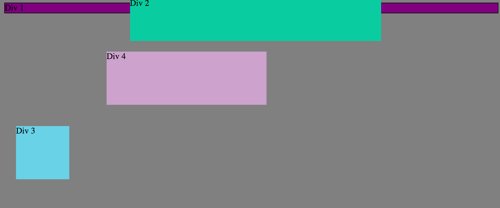
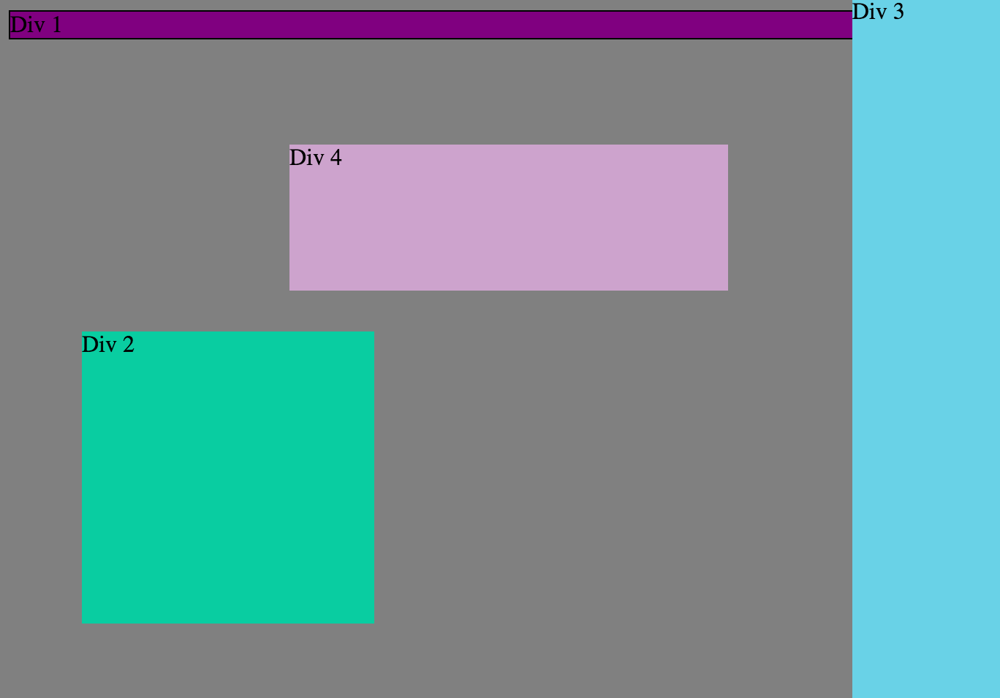

How can you use Chrome's DevTools inspector to help you format or position elements?

  DevTools are a great way to see your formatting changes in real time. It's also a great way to be able to move things around without having to save your changes on versions of your own document.

How can you resize elements on the DOM using CSS?

  You can change their heights and widths by giving them pixel sizes, em sizes, or percentages. CSS provides many ways to change styling.

What are the differences between Absolute, Fixed, Static, and Relative positioning? Which did you find easiest to use? Which was most difficult?

  Absolute - positioned relative to nearest html element
  Fixed - same position even if the page scrolls; keeps position based on right/left/bottom/top specifications
  Static - default position; presents itself in the normal flow of the page, how it's placed out in the html.
  Relative - position is relative to it's normal html position

  Static is the easiest because it's the default. The most difficult to use was relative because we couldn't figure out what it was referring to at first. But, it wasn't horribly difficult anyway.

What are the differences between Margin, Border, and Padding?

  Margin - The placce outside the border
  Border - The line that goes around the outside of the css box
  Padding - The area between the content and the border

What was your impression of this challenge overall? (love, hate, and why?)

  The challenge was a love/hate one. Changing just the sizes of things was not so hard, but then figuring out exactly how to position them was tough. The satisfaction of finally getting something right was awesome; but getting there could be a little frustrating. CSS is cool when it works!
