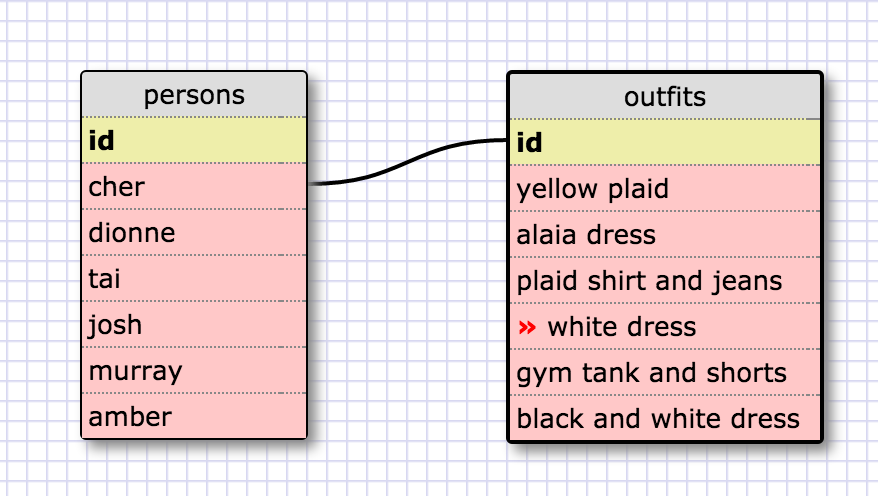

<!-- 1. Select all data for all states. -->

SELECT * FROM states;

<!-- 2. Select all data for all regions. -->

SELECT * FROM regions;

<!-- 3. Select the state_name and population for all states. -->

SELECT state_name, population FROM states;

<!-- 4. Select the state_name and population for all states ordered
by population. The state with the highest population should be at the top. -->

SELECT state_name, population FROM states ORDER BY population DESC;

<!-- 5. Select the state_name for the states in region 7. -->

SELECT state_name FROM states WHERE region_id = 7;

<!-- 6. Select the state_name and population_density for states with a
population density over 50 ordered from least to most dense. -->

SELECT state_name, population_density
  FROM states
WHERE population_density > 50
  ORDER BY population_density;

<!-- 7. Select the state_name for states with a population between 1
million and 1.5 million people. -->

SELECT state_name FROM states WHERE population BETWEEN 1000000 AND 1500000;

<!-- 8. Select the state_name and region_id for states ordered by region in
  ascending order. -->

SELECT state_name, region_id FROM states ORDER BY region_id;

<!-- 9. Select the region_name for the regions with "Central" in the name. -->

SELECT region_name FROM regions WHERE region_name LIKE '%Central%';

<!-- 10. Select the region_name and the state_name for all states and regions
in ascending order by region_id. Refer to the region by name. (This will
involve joining the tables). -->

SELECT regions.region_name, states.state_name
  FROM regions
  INNER JOIN states
  ON regions.id=states.region_id;

<!-- My Clueless Schema -->

<!--

REFLECTION

What are databases for?

We use databases to store information -- usually large amounts of complex
info that can be used for many purposes.

What is a one-to-many relationship?

A one-to-many relationship means that one table's row can actually relate
to many rows in another table. So, there is one author, for example, but
that one author has many books. In the case of a one-to-many relationship,
it generally makes sense to create a second table to the "many" pieces of
information.

What is a primary key? What is a foreign key? How can you determine which
is which?

A primary key is a unique key for a row/piece of information. This means
that sometimes a primary key is made up for the purposes of a database.
A foreign key is a key in one table that points to a primary key in a
different table. You can determine which is which by running some code
that I found online, which can search for 'FOREIGN_KEY_CONSTRAINT', but
I'm actually not able to find how to figure it out without running some
code.

How can you select information out of a SQL database? What are some
general guidelines for that?

You can select information from a SQL database using the SQL commands.
I sort of like the idea of first selecting everything from a table,
just to see what's in there.
'SELECT * FROM [table_name]'
Once you see everything that's there, you would continue "SELECT"ing
code as you see fit. You can choose to return only certain columns by
writing
'SELECT column1, column2 FROM table_name'
You can go on to restrict what you're looking for with key words like
'WHERE', which is really common. You would add a condition after
'WHERE', like 'WHERE row > 100' or something.
Finally, never forget to add a ';' at the end of your SELECT statement
because SQL won't work if you don't!

-->