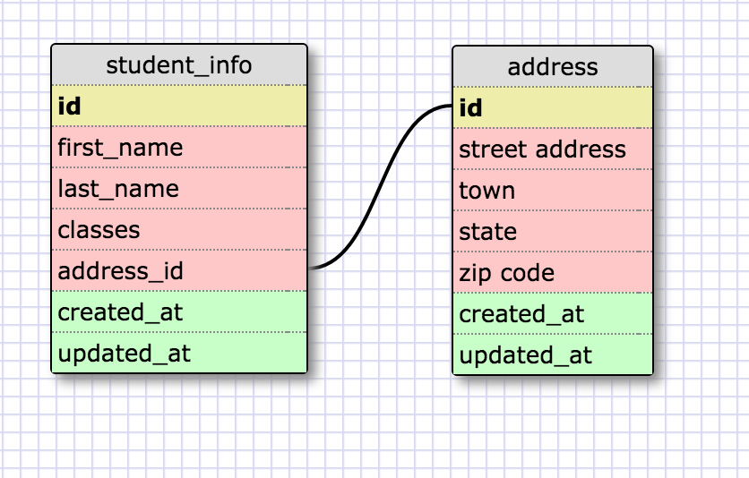
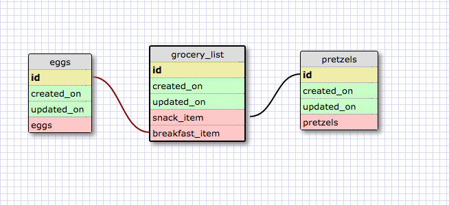

Release 2

Release 4

REFLECTION

What is a one-to-one database?

A one-to-one database is a database in which the items associated with
each other are basically pairs. The one thing can only relate to the one
other thing.

When would you use a one-to-one database? (Think generally, not in
terms of the example you created).

I would use a one-to-one database when a group of fields can be empty;
meaning, you wouldn't want to create a database where there could be
tables with many empty fields. Instead, you would create a separate
table for the one-to-one related items.

What is a many-to-many database?

A many-to-many database is a database where many different types of one
thing can relate to many different types of other things. So, you can
have many different types of cereals and many different types of milks,
but when you go to make breakfast, you only choose one type of cereal
and one type of milk. Many-to-many databases have 'join tables,' which
operate to describe the actual meal you have (i.e. the combination of
the type of cereal and the type of milk).

When would you use a many-to-many database? (Think generally, not in
terms of the example you created).

You use a many-to-many database when you have categories of things that
can relate to other categories of things. There isn't a specific type
of thing that relates ONLY to one type of thing. To put it another way,
you could use a many-to-many database when you have a collection of
many different categories/classes of information that relate to others.

What is confusing about database schemas? What makes sense?

I think without a concrete example, it's hard for me to actually know
when to split something into multiple tables and when to just keep going
with a list. I think it would be easy to make too many individual tables
or too tables with too much information. It's hard to know exactly how
everything will relate to each other.